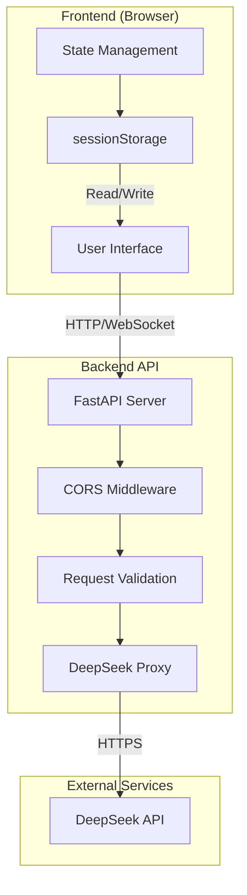

# Design Document: Web Chat Application

## Overview

The Web Chat Application is a full-stack system that enables users to interact with an AI legal advisor through a web browser. Users can send messages, receive streamed AI responses, and maintain conversation history within a session.

The system consists of two primary components:
- **Frontend**: A web-based user interface for displaying chat messages and capturing user input
- **Backend API**: A Python server that handles client requests and communicates with the DeepSeek AI service

### Design Goals

1. **Real-time Streaming**: Display AI responses as they are generated for immediate feedback
2. **Session Persistence**: Maintain conversation context within the browser session
3. **Error Resilience**: Provide clear error messages and retry mechanisms for failures
4. **Responsive UX**: Ensure smooth user interactions with loading states and input validation
5. **Secure Configuration**: Manage API keys and CORS settings through configuration

### Technology Stack

- **Frontend**: React (or Vanilla JavaScript), HTML, CSS
- **Backend**: Python with FastAPI framework
- **AI Service**: DeepSeek API (deepseek-chat model)
- **Storage**: sessionStorage (frontend) for conversation history

---

## Architecture

### System Architecture Diagram



### Component Architecture

```mermaid
flowchart LR
    subgraph Frontend
        ChatView[Chat View Component]
        InputPanel[Input Panel]
        MessageList[Message List]
        LoadingIndicator[Loading Indicator]
    end
    
    subgraph Backend
        RouteHandler[/api/chat endpoint]
        RequestValidator[Request Validator]
        HistoryManager[History Manager]
        StreamProxy[Stream Proxy]
    end
    
    ChatView --> MessageList
    ChatView --> InputPanel
    InputPanel --> RouteHandler
    RouteHandler --> RequestValidator
    RequestValidator --> HistoryManager
    HistoryManager --> StreamProxy
```

### Data Flow

1. **Message Send Flow**:
   - User types message in Input_Field
   - User clicks Send_Button or presses Enter
   - Frontend validates input (non-empty, max 5000 chars)
   - Frontend sends POST request to /api/chat
   - Backend validates request
   - Backend streams response from DeepSeek API
   - Frontend displays streaming content in Chat_History
   - Frontend stores conversation in sessionStorage

2. **Clear Flow**:
   - User clicks Clear_Button
   - Frontend clears Chat_History display
   - Frontend clears sessionStorage
   - UI resets to initial state

---

## Components and Interfaces

### Frontend Components

#### ChatView Component

**Responsibilities**:
- Container for the entire chat interface
- Manages overall application state

**Public Interface**:
```typescript
interface ChatViewProps {
  // No props - self-contained
}

// Internal state
interface ChatViewState {
  messages: Message[];
  isLoading: boolean;
  error: string | null;
  retryCount: number;
}
```

#### MessageList Component

**Responsibilities**:
- Display all messages in chronological order
- Render user messages (right-aligned, distinct color)
- Render AI messages (left-aligned, different color)
- Manage 100-message limit

**Public Interface**:
```typescript
interface MessageListProps {
  messages: Message[];
  isStreaming: boolean;
  currentStreamingMessage: string;
}

interface Message {
  id: string;
  role: 'user' | 'assistant';
  content: string;
  timestamp: number;
}
```

**Styling Requirements**:
- User messages: right-aligned, blue/green background
- AI messages: left-aligned, gray background
- Maximum 100 messages, oldest removed when exceeded

#### InputPanel Component

**Responsibilities**:
- Capture user input
- Validate input (non-empty, max 5000 chars)
- Handle send action (button click or Enter key)
- Disable during loading or when disconnected

**Public Interface**:
```typescript
interface InputPanelProps {
  disabled: boolean;
  onSend: (message: string) => void;
  preservedInput?: string;
}

interface InputPanelState {
  inputValue: string;
}
```

**Validation Rules**:
- Must not be empty or whitespace-only
- Maximum 5000 characters

#### LoadingIndicator Component

**Responsibilities**:
- Display loading state to user
- Show within 200ms of sending request
- Hide when streaming completes or error occurs

**Public Interface**:
```typescript
interface LoadingIndicatorProps {
  visible: boolean;
}
```

#### ClearButton Component

**Responsibilities**:
- Clear all messages and reset conversation

**Public Interface**:
```typescript
interface ClearButtonProps {
  onClear: () => void;
}
```

### Backend Components

#### FastAPI Application

**Responsibilities**:
- HTTP server setup
- CORS middleware configuration
- Request routing

**Public Interface**:
```python
from fastapi import FastAPI
from fastapi.middleware.cors import CORSMiddleware

app = FastAPI(title="Legal Advisor API")

# CORS configuration
app.add_middleware(
    CORSMiddleware,
    allow_origins=["http://localhost:3000"],  # Configurable
    allow_methods=["POST", "OPTIONS"],
    allow_headers=["Content-Type"]
)
```

#### Chat Endpoint (/api/chat)

**Responsibilities**:
- Receive POST requests with user messages
- Validate request payload
- Forward to DeepSeek API with conversation history
- Stream responses back to client

**Request Format**:
```typescript
interface ChatRequest {
  message: string;        // Required, non-empty
  history?: Message[];    // Optional conversation history
}
```

**Response Format**:
- Streaming Server-Sent Events (SSE)
- Each chunk contains partial content

**Error Responses**:
- HTTP 400: Malformed JSON or empty message
- HTTP 401: DeepSeek authentication error
- HTTP 502: DeepSeek API failure or timeout (30s)

#### RequestValidator

**Responsibilities**:
- Validate JSON structure
- Validate message field presence and content

**Public Interface**:
```python
def validate_chat_request(data: dict) -> tuple[bool, str | None]:
    """Returns (is_valid, error_message)"""
    
    # Check: JSON is well-formed
    # Check: "message" field exists and is non-empty
    # Check: "message" is a string
```

#### HistoryManager

**Responsibilities**:
- Extract and limit conversation history
- Limit to most recent 20 messages for DeepSeek API

**Public Interface**```python
def limit_history(messages: list[Message], max_count: int = 20) -> list[Message]:
    """Returns the most recent N messages"""
```

#### StreamProxy

**Responsibilities**:
- Forward requests to DeepSeek API
- Stream responses back to client
- Handle timeout (30 seconds)
- Handle errors and transform to appropriate HTTP responses

**Public Interface**:
```python
async def stream_chat_response(
    message: str,
    history: list[Message],
    api_key: str
) -> StreamingResponse:
    """Streams AI response from DeepSeek API"""
```

### API Contracts

#### Frontend → Backend API

**Endpoint**: `POST /api/chat`

**Request**:
```http
POST /api/chat HTTP/1.1
Content-Type: application/json
Origin: http://localhost:3000

{
  "message": "What is contract law?",
  "history": [
    {"role": "user", "content": "Hello"},
    {"role": "assistant", "content": "Hi, how can I help?"}
  ]
}
```

**Success Response** (Streaming):
```http
HTTP/1.1 200 OK
Content-Type: text/event-stream
Access-Control-Allow-Origin: http://localhost:3000

data: {"content": "Contract", "done": false}

data: {"content": " law", "done": false}

data: {"content": " is...", "done": true}
```

**Error Responses**:
```http
HTTP/1.1 400 Bad Request
Content-Type: application/json

{"error": "Invalid request: message field is required"}

HTTP/1.1 400 Bad Request
Content-Type: application/json

{"error": "Invalid request: message cannot be empty"}

HTTP/1.1 401 Unauthorized
Content-Type: application/json

{"error": "Authentication failed: invalid API key"}

HTTP/1.1 502 Bad Gateway
Content-Type: application/json

{"error": "Upstream service unavailable"}
```

#### Backend → DeepSeek API

**Endpoint**: `https://api.deepseek.com/v1/chat/completions`

**Request**:
```python
{
  "model": "deepseek-chat",
  "messages": [
    {"role": "system", "content": "You are a professional legal advisor assistant"},
    {"role": "user", "content": "What is contract law?"},
    {"role": "assistant", "content": "Contract law is..."},
    {"role": "user", "content": "Thank you"}
  ],
  "stream": True
}
```

---

## Data Models

### Message

```typescript
interface Message {
  /** Unique identifier for the message */
  id: string;
  
  /** Role of the message sender */
  role: 'user' | 'assistant';
  
  /** Content of the message */
  content: string;
  
  /** Unix timestamp in milliseconds */
  timestamp: number;
}
```

### ChatRequest (Frontend to Backend)

```typescript
interface ChatRequest {
  /** The user's message content */
  message: string;
  
  /** Optional conversation history for context */
  history?: Array<{
    role: 'user' | 'assistant';
    content: string;
  }>;
}
```

### ChatResponseChunk (Streaming)

```typescript
interface ChatResponseChunk {
  /** Partial content from the AI */
  content: string;
  
  /** Whether this is the final chunk */
  done: boolean;
}
```

### ErrorResponse

```typescript
interface ErrorResponse {
  /** Human-readable error message */
  error: string;
  
  /** Optional error code for programmatic handling */
  code?: string;
}
```

### Backend Configuration

```typescript
interface BackendConfig {
  /** DeepSeek API key */
  deepseekApiKey: string;
  
  /** Allowed CORS origin */
  corsOrigin: string;
  
  /** DeepSeek API base URL */
  deepseekBaseUrl: string;
  
  /** Request timeout in seconds */
  requestTimeout: number;
  
  /** Maximum history messages to send to DeepSeek */
  maxHistoryMessages: number;
}
```

### Frontend Configuration

```typescript
interface FrontendConfig {
  /** Backend API URL */
  apiUrl: string;
  
  /** Maximum message length */
  maxMessageLength: number;
  
  /** Maximum messages in history */
  maxHistoryMessages: number;
  
  /** Local storage key for conversation */
  storageKey: string;
}
```

### Session Storage Schema

```json
{
  "chat_history": [
    {
      "id": "msg_1234567890",
      "role": "user",
      "content": "What is contract law?",
      "timestamp": 1234567890
    },
    {
      "id": "msg_1234567891",
      "role": "assistant",
      "content": "Contract law is...",
      "timestamp": 1234567891
    }
  ]
}
```

---

## Correctness Properties

*A property is a characteristic or behavior that should hold true across all valid executions of a system—essentially, a formal statement about what the system should do. Properties serve as the bridge between human-readable specifications and machine-verifiable correctness guarantees.*

This feature does not include property-based testing. See the Assessment Summary below for details.

### Assessment Summary

After analyzing the requirements for the web-chat-app feature, **Property-Based Testing (PBT) is NOT appropriate** for this feature. Here's why:

**Reasons PBT Does Not Apply**:

1. **UI Rendering**: The frontend consists primarily of React components that render UI. These require snapshot tests and visual regression testing, not property-based tests.

2. **External API Integration**: The backend integrates with DeepSeek's external API. Testing this requires integration tests with mocked responses, not property-based generation of arbitrary inputs.

3. **Streaming Responses**: The streaming behavior involves network I/O and real-time UI updates that cannot be meaningfully tested with randomly generated inputs.

4. **Network Failure Simulation**: Error handling for network failures depends on external infrastructure state, not on code logic that varies with input.

5. **Configuration Validation**: The backend configuration (API keys, CORS origins) is a one-time setup concern, not a function that processes varied inputs.

### What CAN Be Tested with Properties

Some narrow aspects could theoretically use PBT:
- Input validation logic (non-empty, max 5000 chars)
- Message history trimming (100 message limit)

However, these are simple boundary conditions better tested with:
- Unit tests for boundary conditions
- Example-based tests for validation rules

The bulk of this application is:
- User interface behavior → UI tests
- API contract compliance → Integration tests
- External service integration → E2E tests

**No testable properties**: This feature is not suitable for property-based testing due to its UI and external API integration nature. All testing should use unit tests, integration tests, and E2E tests as described in the Testing Strategy section.

**Property Summary**: Not applicable - PBT does not apply to this feature

---

## Error Handling

### Error Categories

| Category | Frontend Action | Retry Allowed |
|----------|-----------------|---------------|
| Network failure | Display "Service unavailable" message | Yes (max 3) |
| API error (4xx) | Display specific error message | No |
| API error (5xx) | Display "Service error" message | Yes (max 3) |
| Timeout (30s) | Display "Request timeout" message | Yes (max 3) |
| Auth error (401) | Display "Authentication failed" | No |

### Frontend Error Handling

```typescript
interface ErrorState {
  message: string;
  retryCount: number;
  preservedInput: string;
  showRetryButton: boolean;
}

// Error display requirements:
// - Must preserve user's input when error occurs
// - Must show retry button
// - Must limit retries to 3 attempts
// - After max retries, prompt user to refresh page
```

### Backend Error Handling

| Error Condition | HTTP Status | Response Body |
|-----------------|-------------|---------------|
| Malformed JSON | 400 | `{"error": "Invalid JSON"}` |
| Missing message field | 400 | `{"error": "message field is required"}` |
| Empty message | 400 | `{"error": "message cannot be empty"}` |
| DeepSeek auth failure | 401 | `{"error": "Authentication failed"}` |
| DeepSeek timeout/failure | 502 | `{"error": "Upstream service unavailable"}` |
| CORS preflight | 200 | CORS headers only |

### Retry Logic

```typescript
const MAX_RETRIES = 3;

async function sendMessageWithRetry(message: string): Promise<void> {
  let retryCount = 0;
  
  while (retryCount < MAX_RETRIES) {
    try {
      await sendMessage(message);
      return;
    } catch (error) {
      retryCount++;
      if (retryCount >= MAX_RETRIES) {
        showMaxRetriesExceededError();
        return;
      }
      await delay(1000 * retryCount); // Exponential backoff
    }
  }
}
```

---

## Testing Strategy

### Testing Approach

Given that PBT does not apply to this feature, the following testing strategies are recommended:

#### Unit Tests

**Coverage Areas**:
- Input validation (empty, whitespace, max length)
- Message history management (100 message limit)
- Configuration parsing and defaults

**Framework**: Jest or Vitest

```typescript
// Example: Input validation unit tests
describe('InputPanel validation', () => {
  test('rejects empty message', () => {
    expect(validateInput('')).toBe(false);
  });
  
  test('rejects whitespace-only message', () => {
    expect(validateInput('   ')).toBe(false);
  });
  
  test('rejects message exceeding 5000 chars', () => {
    const longMessage = 'a'.repeat(5001);
    expect(validateInput(longMessage)).toBe(false);
  });
  
  test('accepts valid message', () => {
    expect(validateInput('What is contract law?')).toBe(true);
  });
});
```

#### Integration Tests

**Coverage Areas**:
- Backend API endpoint validation
- CORS headers
- Request/response format
- DeepSeek API proxy (with mocked responses)

**Framework**: Supertest (backend), React Testing Library (frontend)

```python
# Example: Backend integration tests
def test_chat_endpoint_valid_request():
    response = client.post('/api/chat', json={
        'message': 'What is contract law?'
    })
    assert response.status_code == 200

def test_chat_endpoint_missing_message():
    response = client.post('/api/chat', json={})
    assert response.status_code == 400
    assert 'message' in response.json()['error']
```

#### UI/Snapshot Tests

**Coverage Areas**:
- Component rendering
- Message list display
- Loading indicator visibility
- Error message display

**Framework**: React Testing Library, Jest snapshots

```typescript
// Example: Component snapshot test
test('ChatView renders correctly with messages', () => {
  const messages = [
    { id: '1', role: 'user', content: 'Hello', timestamp: 1000 },
    { id: '2', role: 'assistant', content: 'Hi!', timestamp: 2000 }
  ];
  
  const { container } = render(<ChatView messages={messages} />);
  expect(container).toMatchSnapshot();
});
```

#### E2E Tests

**Coverage Areas**:
- Complete user flow (send message → receive response)
- Streaming behavior
- Error handling and retry
- Clear conversation

**Framework**: Playwright or Cypress

```typescript
// Example: E2E test
test('complete chat flow', async ({ page }) => {
  await page.goto('http://localhost:3000');
  
  // Type and send message
  await page.fill('input[name="message"]', 'What is contract law?');
  await page.click('button[type="submit"]');
  
  // Verify message appears
  await expect(page.locator('.message-user')).toContainText('What is contract law?');
  
  // Wait for AI response
  await expect(page.locator('.message-assistant')).toBeVisible({ timeout: 10000 });
});
```

### Test Coverage Matrix

| Requirement | Unit Test | Integration Test | UI/Snapshot | E2E |
|-------------|-----------|------------------|-------------|-----|
| 1. Display Chat Interface | - | - | Yes | Yes |
| 2. Send User Message | Yes | Yes | Yes | Yes |
| 3. Display AI Response | - | Yes | Yes | Yes |
| 4. Stream AI Response | - | Yes | - | Yes |
| 5. Show Loading State | - | - | Yes | Yes |
| 6. Error Handling | Yes | Yes | Yes | Yes |
| 7. Conversation History | Yes | - | Yes | Yes |
| 8. Clear Conversation | Yes | - | Yes | Yes |
| 9. Backend API Endpoint | - | Yes | - | Yes |
| 10. Backend Configuration | Yes | - | - | - |
| 11. CORS Support | - | Yes | - | Yes |

### Test Configuration

**Property Test Configuration**: Not applicable for this feature.

**Unit Test Configuration**:
- Run on every commit
- Minimum 80% code coverage

**Integration Test Configuration**:
- Run on every PR
- Use mocked DeepSeek API responses

**E2E Test Configuration**:
- Run on main branch merges
- Use real backend or robust mocking

---

## Appendix

### Configuration File Format (config.json)

```json
{
  "deepseekApiKey": "sk-xxxx",
  "corsOrigin": "http://localhost:3000",
  "deepseekBaseUrl": "https://api.deepseek.com",
  "requestTimeout": 30,
  "maxHistoryMessages": 20
}
```

### Environment Variables

| Variable | Required | Default | Description |
|----------|----------|---------|-------------|
| `DEEPSEEK_API_KEY` | Yes* | - | DeepSeek API key (*or via config.json) |
| `CORS_ORIGIN` | No | http://localhost:3000 | Allowed frontend origin |
| `PORT` | No | 8000 | Backend server port |

### Default Values

| Setting | Default Value |
|---------|---------------|
| Max messages in Chat_History | 100 |
| Max input characters | 5000 |
| Max history to DeepSeek | 20 |
| Request timeout | 30 seconds |
| Loading indicator delay | 200ms |
| Optimistic UI update delay | 100ms |
| Max retry attempts | 3 |

### Browser Support

- Chrome (latest 2 versions)
- Firefox (latest 2 versions)
- Safari (latest 2 versions)
- Edge (latest 2 versions)

### Security Considerations

1. **API Key Protection**: DeepSeek API key stored in environment variables or config.json (not committed to version control)
2. **Input Sanitization**: Sanitize user input before displaying or sending to API
3. **CORS Configuration**: Restrict allowed origins to specific frontend URL
4. **Rate Limiting**: Consider implementing rate limiting on backend (future enhancement)
5. **HTTPS**: Backend should run over HTTPS in production